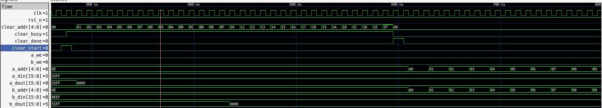
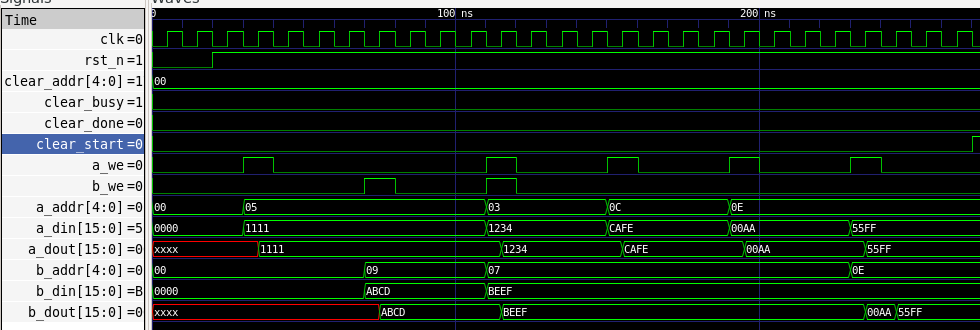
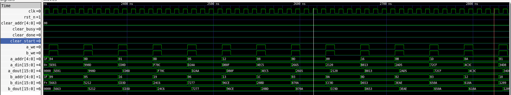
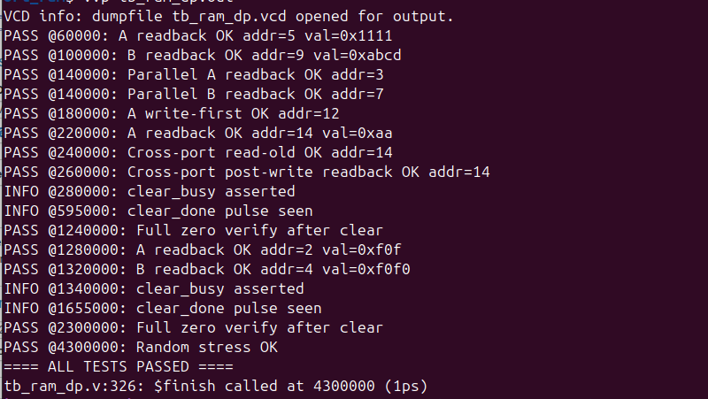

# Dual-Port RAM (Verilog)

This repository contains a **Dual-Port RAM** implementation in Verilog along with a **self-checking testbench**.  
The project demonstrates memory operations such as **read, write, parallel access, and clear functionality** with simulation waveforms.

---

## 📂 Project Structure
```
dual-port-ram/
├── docs/              # Documentation & simulation results
│   ├── dp_ram.md
│   ├── dp_ram_sch
│   ├── ram_dp.svg
│   ├── tb_dp_ram_clear.png
│   ├── tb_dp_ram_output.png
│   ├── tb_dp_ram_parralell_read_write.png
│   └── tb_dp_ram_read_write.png
├── src/               # RTL source files
│   └── dp_ram.v
└── tb/                # Testbenches
    └── tb_ram_dp.v
```

---

## 🚀 Features
- Independent **dual ports** (Port A & Port B) with separate address, data, and control signals  
- **Synchronous write / asynchronous read** support  
- **Clear operation** with busy/done handshake  
- **Parallel read & write** support  
- **Exhaustive testbench** that validates:
  - Reset  
  - Sequential writes  
  - Parallel read/write  
  - Clear operation  
  - Output verification  

---

## 🛠 Tools Used
- [Icarus Verilog](http://iverilog.icarus.com/) – Simulation  
- [GTKWave](http://gtkwave.sourceforge.net/) – Waveform visualization  
- [TerosHDL](https://teroshdl.com/) – Project organization & block diagrams  

---

## ▶️ How to Run
1. Clone this repository:
   ```bash
   git clone git@github.com:your-username/dual-port-ram.git
   cd dual-port-ram
   ```
2. Compile:
   ```bash
   iverilog  -o dp_ram_tb src/dp_ram.v tb/tb_ram_dp.v
   ```
3. Run simulation:
   ```bash
   vvp dp_ram_tb
   ```
4. View waveforms:
   ```bash
   gtkwave dump.vcd
   ```

---

## 📊 Simulation Results
- **Clear Operation**  
    

- **Read/Write**  
    

- **Parallel Read/Write**  
    

- **Output Verification**  
    

---

## 📖 Documentation
- 📖 [User Guide](docs/README_user_guide.md) – Step-by-step instructions on how to use, simulate, and extend the dual-port RAM.
- 📂 [Design Sources](src) – RTL files.
- 🧪 [Testbenches](tb) – Verification environment and test scenarios.

---

## 👤 Author
**Arnold Alinda**  
Master’s of engneering (Computer & Microelectronics Systems), UTM  

