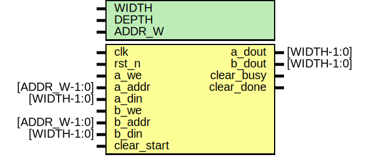

# Entity: ram_dp 
- **File**: dp_ram.v

## Diagram

## Generics

| Generic name | Type | Value | Description |
| ------------ | ---- | ----- | ----------- |
| WIDTH        |      | 16    |             |
| DEPTH        |      | 16    |             |
| ADDR_W       |      | 4     |             |

## Ports

| Port name   | Direction | Type         | Description |
| ----------- | --------- | ------------ | ----------- |
| clk         | input     |              |             |
| rst_n       | input     |              |             |
| a_we        | input     |              |             |
| a_addr      | input     | [ADDR_W-1:0] |             |
| a_din       | input     | [WIDTH-1:0]  |             |
| a_dout      | output    | [WIDTH-1:0]  |             |
| b_we        | input     |              |             |
| b_addr      | input     | [ADDR_W-1:0] |             |
| b_din       | input     | [WIDTH-1:0]  |             |
| b_dout      | output    | [WIDTH-1:0]  |             |
| clear_start | input     |              |             |
| clear_busy  | output    |              |             |
| clear_done  | output    |              |             |

## Signals

| Name            | Type             | Description |
| --------------- | ---------------- | ----------- |
| mem [0:DEPTH-1] | reg [WIDTH-1:0]  |             |
| clear_addr      | reg [ADDR_W-1:0] |             |
| a_we_eff        | reg              |             |
| a_addr_eff      | reg [ADDR_W-1:0] |             |
| a_din_eff       | reg [WIDTH-1:0]  |             |
| b_we_eff        | reg              |             |
| b_addr_eff      | reg [ADDR_W-1:0] |             |
| b_din_eff       | reg [WIDTH-1:0]  |             |

## Processes
- unnamed: ( @(posedge clk or negedge rst_n) )
  - **Type:** always
- unnamed: ( @* )
  - **Type:** always
- unnamed: ( @(posedge clk) )
  - **Type:** always
- unnamed: ( @(posedge clk) )
  - **Type:** always
